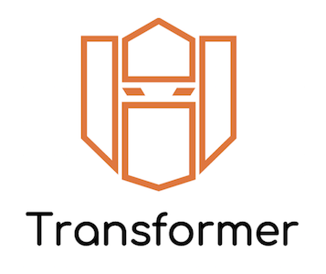

<p align="center">

<br>
<a href="https://travis-ci.org/zalando-incubator/Transformer"></a>
<a href="https://www.codacy.com/app/thilp/Transformer"></a>
<a href="https://www.codacy.com/app/thilp/Transformer"></a>
</p>

# Transformer

A tool to convert web browser sessions ([HAR files][]) into
[Locust][] load testing scenarios (locustfiles).

Use it when you want to **replay HAR files** (containing recordings of
interactions with your website) **in load tests with Locust**.

[HAR files]: https://en.wikipedia.org/wiki/.har
[Locust]: https://locust.io/

<!-- toc -->

- [Installation](#installation)
- [Usage](#usage)
  * [Command-line](#command-line)
  * [Library](#library)
- [Documentation](#documentation)
- [Authors](#authors)
- [License](#license)

<!-- tocstop -->

## Installation

Install from PyPI with pip:

```bash
pip install har-transformer
```

## Usage

### Command-line

```bash
$ transformer my_scenarios_dir/
```

### Library

```python
import transformer

with open("locustfile.py", "w") as f:
    transformer.dump(f, ["my_scenarios_dir/"])
```

Example HAR files are included in the `examples` directory for you to try out.

## Documentation

Take a look at our **[user documentation][doc]** for more details, including
how to generate HAR files, customize your scenarios, use or write plugins …

[doc]: https://github.com/zalando-incubator/transformer/wiki

## Authors

* **Serhii Cherniavskyi** - [@scherniavsky](https://github.com/scherniavsky)
* **Thibaut Le Page** - [@thilp](https://github.com/thilp)
* **Brian Maher** - [@bmaher](https://github.com/bmaher)
* **Oliwia Zaremba** - [@tortila](https://github.com/tortila)

See also the list of [contributors](CONTRIBUTORS.md) who participated in this project.

## License

This project is licensed under the MIT License - see the
[LICENSE.md](LICENSE.md) file for details.
